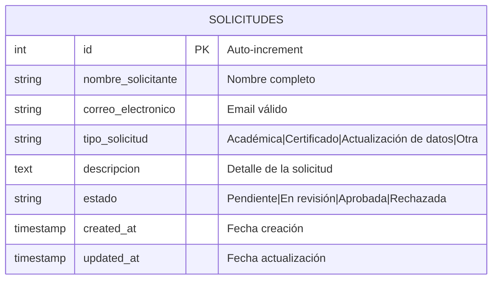
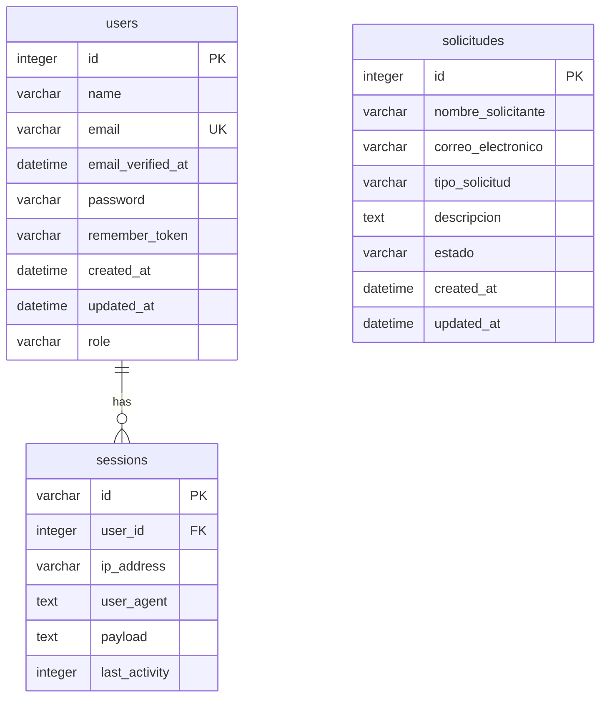
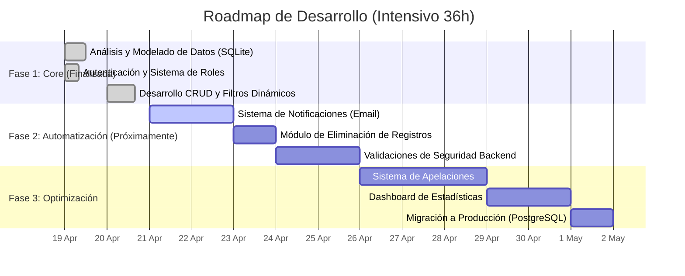

# PRUEBA-T-CNICA-DESARROLLADOR-A
La presente prueba tiene como objetivo evaluar la capacidad del postulante para analizar, diseñar e implementar una solución de software en un contexto similar al de los sistemas institucionales de la Universidad.

## Contexto de la problematica
La Universidad requiere implementar un módulo básico para gestionar solicitudes administrativas internas, tales como:

- Solicitudes académicas
- Certificados
- Actualización de datos
- Otras solicitudes similares

Estas solicitudes son ingresadas por usuarios internos y posteriormente revisadas por unidades administrativas.

# Guia Instalación proyecto

- se requiere tener previamente instalado xampp (para tener php nativo)
- se requiere tener previamente instalado composer (para gestionar paquetes de laravel)

```
laravel new my-app

 ██╗       █████╗  ██████╗   █████╗  ██╗   ██╗ ███████╗ ██╗
 ██║      ██╔══██╗ ██╔══██╗ ██╔══██╗ ██║   ██║ ██╔════╝ ██║
 ██║      ███████║ ██████╔╝ ███████║ ██║   ██║ █████╗   ██║
 ██║      ██╔══██║ ██╔══██╗ ██╔══██║ ╚██╗ ██╔╝ ██╔══╝   ██║
 ███████╗ ██║  ██║ ██║  ██║ ██║  ██║  ╚████╔╝  ███████╗ ███████╗
 ╚══════╝ ╚═╝  ╚═╝ ╚═╝  ╚═╝ ╚═╝  ╚═╝   ╚═══╝   ╚══════╝ ╚══════╝

 Which starter kit would you like to install? [None]:
  [none    ] None
  [react   ] React
  [svelte  ] Svelte
  [vue     ] Vue
  [livewire] Livewire
 > 


 Which testing framework do you prefer? [Pest]:
  [0] Pest
  [1] PHPUnit
 > 1


 Do you want to install Laravel Boost to improve AI assisted coding? (yes/no) [yes]:
 > no

Creating a "laravel/laravel" project at "./my-app"
Cannot use laravel/laravel's latest version v13.2.0 as it requires php ^8.3 which is not satisfied by your platform.
Installing laravel/laravel (v12.12.2)
  - Installing laravel/laravel (v12.12.2): Extracting archive
Created project in C:\Users\josue\OneDrive\Documentos\2026\PRUEBA-T-CNICA-DESARROLLADOR-A/my-app
Loading composer repositories with package information
Updating dependencies
Lock file operations: 111 installs, 0 updates, 0 removals
  - Locking brick/math (0.14.8)
  - Locking carbonphp/carbon-doctrine-types (3.2.0)
  - Locking dflydev/dot-access-data (v3.0.3)
Writing lock file
Installing dependencies from lock file (including require-dev)
Package operations: 111 installs, 0 updates, 0 removals
  - Installing phar-io/version (3.2.1): Extracting archive
  - Installing phar-io/manifest (2.0.4): Extracting archive
  - Installing myclabs/deep-copy (1.13.4): Extracting archive
  - Installing phpunit/phpunit (11.5.55): Extracting archive
69 package suggestions were added by new dependencies, use `composer suggest` to see details.
Generating optimized autoload files
81 packages you are using are looking for funding.
Use the `composer fund` command to find out more!
No security vulnerability advisories found.
> @php -r "file_exists('.env') || copy('.env.example', '.env');"

   INFO  Application key set successfully.  


 Which database will your application use? [SQLite]:
  [sqlite ] SQLite
  [mysql  ] MySQL
  [mariadb] MariaDB
  [pgsql  ] PostgreSQL (Missing PDO extension)
  [sqlsrv ] SQL Server (Missing PDO extension)
 > 


   INFO  Preparing database.  

  Creating migration table ............................................................................................................ 10.28ms DONE

   INFO  Running migrations.  

  0001_01_01_000000_create_users_table ................................................................................................ 25.47ms DONE
  0001_01_01_000001_create_cache_table ................................................................................................ 16.78ms DONE
  0001_01_01_000002_create_jobs_table ................................................................................................. 24.06ms DONE


 Would you like to run npm install --ignore-scripts and npm run build? (yes/no) [yes]:
 > 

"npm" no se reconoce como un comando interno o externo,
programa o archivo por lotes ejecutable.
   INFO  Application ready in [my-app]. You can start your local development using:

➜ cd my-app
➜ composer run dev
```

### Crear la migración y el modelo para Solicitud

```
php artisan make:model Solicitud -m
```
Esto crea el modelo Solicitud y su migración. Dejandolo en la ruta database/migrations/xxxx_xx_xx_xxxxxx_create_solicitudes_table.php

####  Luego ejecuta la migración:

```
php artisan migrate
```

### Definir el Modelo Solicitud
En app/Models/Solicitud.php, se agregan los campos requeridos

```
protected $fillable = [
        'nombre_solicitante',
        'correo_electronico',
        'tipo_solicitud',
        'descripcion',
        'estado',
    ];
```

###  Crear el Controlador con recurso completo

```
php artisan make:controller SolicitudController --resource --model=Solicitud
```

En app/Http/Controllers/SolicitudController.php. Implementaremos los métodos index, store, update y las validaciones.
```
 public function index(Request $request)
    {
        $query = Solicitud::query();

        // Filtro por estado
        if ($request->filled('estado')) {
            $query->where('estado', $request->estado);
        }

        // Filtro por tipo de solicitud
        if ($request->filled('tipo')) {
            $query->where('tipo_solicitud', $request->tipo);
        }

        // Filtro por texto libre (nombre o correo)
        if ($request->filled('buscar')) {
            $buscar = $request->buscar;
            $query->where(function ($q) use ($buscar) {
                $q->where('nombre_solicitante', 'like', "%{$buscar}%")
                  ->orWhere('correo_electronico', 'like', "%{$buscar}%");
            });
        }

        $solicitudes = $query->orderBy('created_at', 'desc')->paginate(10);

        // Obtener listados para los selects de filtros
        $tipos = Solicitud::tipos();
        $estados = Solicitud::estados();

        return view('solicitudes.index', compact('solicitudes', 'tipos', 'estados'));
    }
```
```

    public function edit(Solicitud $solicitud)
    {
        $estados = Solicitud::estados();
        return view('solicitudes.edit', compact('solicitud', 'estados'));
    }
```    

```
     public function update(Request $request, Solicitud $solicitud)
    {
        $validated = $request->validate([
            'estado' => ['required', Rule::in(Solicitud::estados())],
        ]);

        $solicitud->update($validated);

        return redirect()->route('solicitudes.index')
                         ->with('success', 'Estado actualizado correctamente.');
    }
```

### Definir rutas y crear vistas
```
<?php

use App\Http\Controllers\SolicitudController;
use Illuminate\Support\Facades\Route;

Route::get('/', function () {
    return redirect()->route('solicitudes.index');
});

Route::resource('solicitudes', SolicitudController::class);
```

en la carpeta resources/views se crearan las vistas, para luego ejecutar el siguiente comando para ejecutar el proyecto
```
php artisan serve
``` 

# Estructura base de datos



# Script de creacion base de datos
si se desea usar una manera rapida de crear la base de datos sin necesidad de usar las migraciones se puede ejecutar el siguiente script
```
CREATE TABLE IF NOT EXISTS "migrations" ("id" integer primary key autoincrement not null, "migration" varchar not null, "batch" integer not null);
CREATE TABLE sqlite_sequence(name seq);
CREATE TABLE IF NOT EXISTS "users" ("id" integer primary key autoincrement not null, "name" varchar not null, "email" varchar not null, "email_verified_at" datetime, "password" varchar not null, "remember_token" varchar, "created_at" datetime, "updated_at" datetime);
CREATE UNIQUE INDEX "users_email_unique" on "users" ("email");
CREATE TABLE IF NOT EXISTS "password_reset_tokens" ("email" varchar not null, "token" varchar not null, "created_at" datetime, primary key ("email"));
CREATE TABLE IF NOT EXISTS "sessions" ("id" varchar not null, "user_id" integer, "ip_address" varchar, "user_agent" text, "payload" text not null, "last_activity" integer not null, primary key ("id"));
CREATE INDEX "sessions_user_id_index" on "sessions" ("user_id");
CREATE INDEX "sessions_last_activity_index" on "sessions" ("last_activity");
CREATE TABLE IF NOT EXISTS "cache" ("key" varchar not null, "value" text not null, "expiration" integer not null, primary key ("key"));
CREATE INDEX "cache_expiration_index" on "cache" ("expiration");
CREATE TABLE IF NOT EXISTS "cache_locks" ("key" varchar not null, "owner" varchar not null, "expiration" integer not null, primary key ("key"));
CREATE INDEX "cache_locks_expiration_index" on "cache_locks" ("expiration");
CREATE TABLE IF NOT EXISTS "jobs" ("id" integer primary key autoincrement not null, "queue" varchar not null, "payload" text not null, "attempts" integer not null, "reserved_at" integer, "available_at" integer not null, "created_at" integer not null);
CREATE INDEX "jobs_queue_index" on "jobs" ("queue");
CREATE TABLE IF NOT EXISTS "job_batches" ("id" varchar not null, "name" varchar not null, "total_jobs" integer not null, "pending_jobs" integer not null, "failed_jobs" integer not null, "failed_job_ids" text not null, "options" text, "cancelled_at" integer, "created_at" integer not null, "finished_at" integer, primary key ("id"));
CREATE TABLE IF NOT EXISTS "failed_jobs" ("id" integer primary key autoincrement not null, "uuid" varchar not null, "connection" text not null, "queue" text not null, "payload" text not null, "exception" text not null, "failed_at" datetime not null default CURRENT_TIMESTAMP);
CREATE UNIQUE INDEX "failed_jobs_uuid_unique" on "failed_jobs" ("uuid");
CREATE TABLE IF NOT EXISTS "solicitudes" ("id" integer primary key autoincrement not null, "nombre_solicitante" varchar not null, "correo_electronico" varchar not null, "tipo_solicitud" varchar not null, "descripcion" text not null, "estado" varchar check ("estado" in ('Pendiente', 'En revisión', 'Aprobada', 'Rechazada')) not null default 'Pendiente', "created_at" datetime, "updated_at" datetime);
```

# Supuestos Realizados

- Autenticación de Usuarios: Se asume que solo los usuarios con el rol de admin tienen acceso al panel de gestión y capacidad para actualizar el estado de las solicitudes.

- Gestión de Estados: Se ha establecido un flujo de estados fijo (Pendiente, En revisión, Aprobada, Rechazada) para estandarizar el ciclo de vida de cada requerimiento.

- Persistencia de Sesiones: El sistema utiliza la tabla sessions en la base de datos para mantener el estado de la conexión de los usuarios de forma persistente entre reinicios del servidor.

- Disponibilidad de Datos: Se asume que el sistema operará inicialmente con una base de datos local (SQLite) para facilitar la portabilidad en entornos de evaluación


# Decisiones Técnicas Relevantes

Uso de Laravel Framework: Se eligió Laravel por su robusto sistema de migraciones, Eloquent ORM y su capacidad para manejar lógica compleja mediante controladores de recursos de forma rápida.


Eloquent ORM: Se implementó para interactuar con la base de datos de manera segura, utilizando el modelo Solicitud con protección de asignación masiva mediante $fillable.


Filtros de Búsqueda Dinámicos: Se implementó una lógica de filtrado en el controlador SolicitudController que permite realizar búsquedas por estado, tipo y texto libre (nombre o correo), optimizando la experiencia del administrador.


Paginación de Resultados: Se utiliza la paginación nativa de Laravel (10 registros por página) para asegurar que la interfaz de administración sea fluida incluso con un alto volumen de solicitudes.

# ⚠️ Limitaciones de la Solución

Notificaciones Automatizadas: Actualmente, el sistema no realiza el envío de correos electrónicos automáticos a los usuarios cuando su solicitud cambia de estado (ej. de "Pendiente" a "Aprobada").

Gestión de Borrado: No se ha implementado una función para eliminar solicitudes del sistema, manteniendo todos los registros de forma histórica y permanente.

Proceso de Apelación: La solución actual no contempla una opción para que el solicitante pueda apelar o solicitar una reevaluación en caso de que su requerimiento sea rechazado.

Entorno de Estilos: La aplicación depende de una instalación correcta de dependencias de Node.js/NPM para la compilación de assets, lo cual puede ser una restricción en entornos sin estas herramientas preinstaladas.

# 🗺️ Roadmap de Implementación

